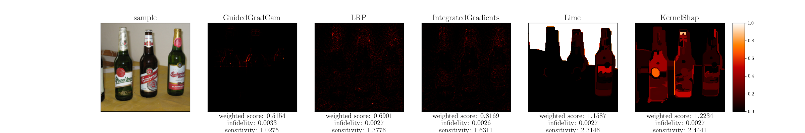
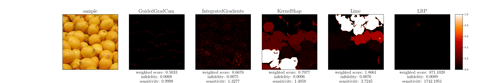
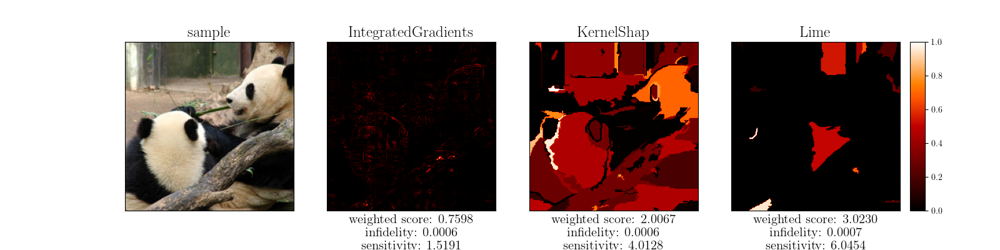

# PnP XAI

This repository contains the demo code for PnP XAI system.

## Installation
All Python dependencies are listed in [`environment.yml`](environment.yml). To set up the environment, follow these steps:
1. Install the Anaconda environment by running the following command:
    ```shell
    conda env create -f environment.yml
    ```
2. Activate `pnp_xai` environment:
    ```shell
    conda activate pnp_xai
    ```
3. Install the codebase by running:
    ```shell
    pip install -e .
    ```

## Usage
### Example Usage
You can use the following command to run the explanation code:
```shell
python -W ignore -m scripts.SCRIPT
```
The placeholder should be replaced wit hthe appropriate script file:
* `SCRIPT`: A script code that defines a model and data to be explained with PnP XAI.
Explanation results will be saved at `$pnp_xai/results/{model}/{dataset}/{sample_idx}.png`.

## Example Results
### VGG-16
<p align='center'>
    
</p>

### ResNet-18
<p align='center'>
    
</p>

### ViT-b-16
<p align='center'>
    
</p>
